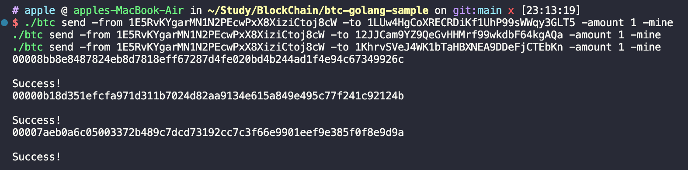
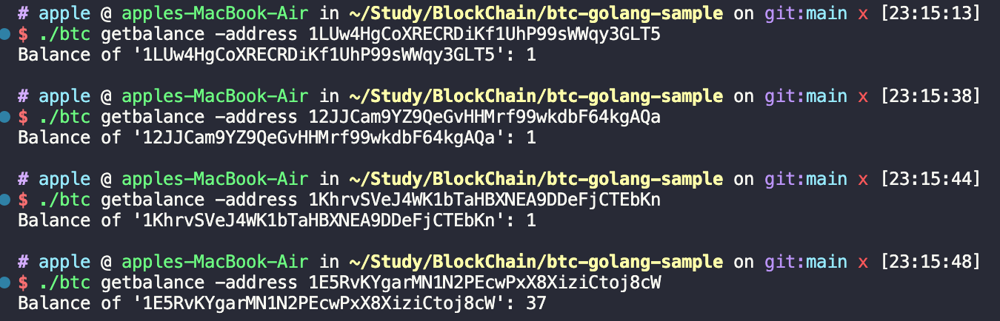
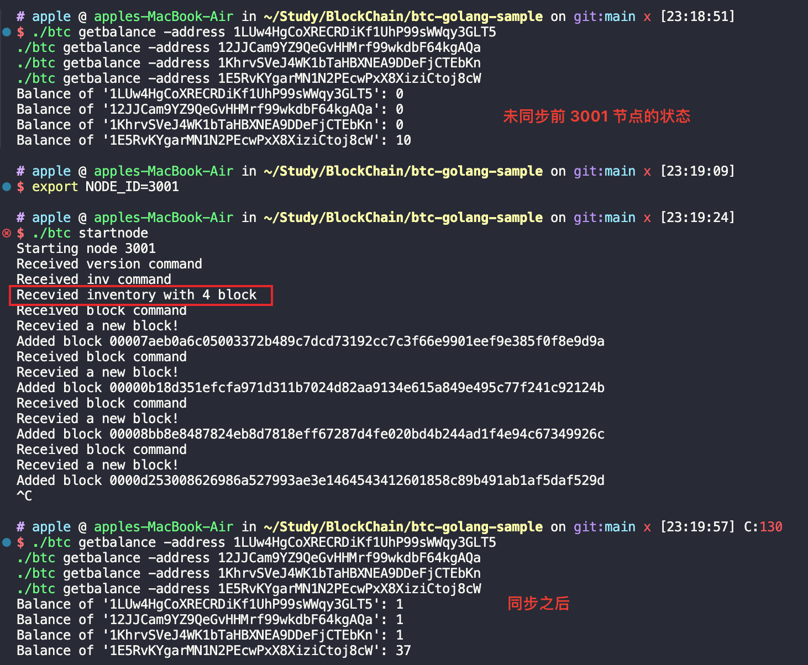
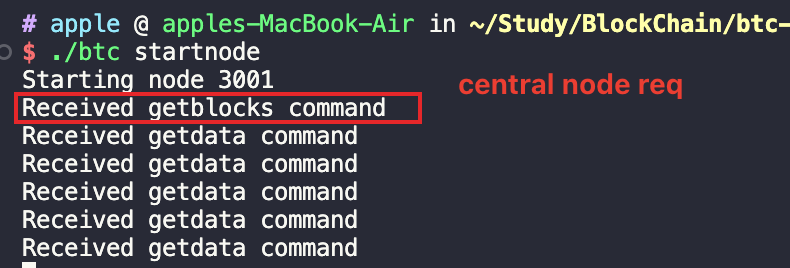
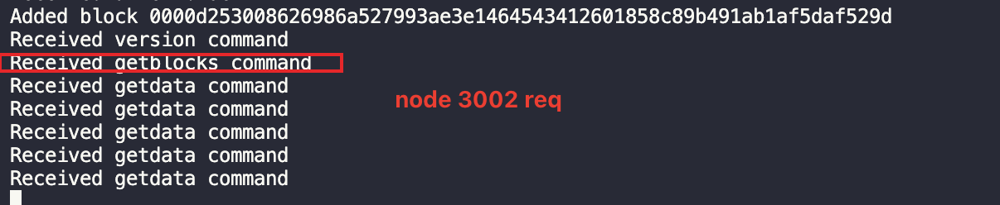

Blockchain Usage
------

**0 编译**

编译为可执行的二进制文件

```go
go build -o btc
```


**1 在 terminal1 执行**

```go
./btc createwallet
```

得到 address1: 1E5RvKYgarMN1N2PEcwPxX8XiziCtoj8cW

初次调用 createwallet 的地址才拥有初始奖励（10BTC）一旦钱包文件创建出来，后面生成的钱包中默认都是 0 个 BTC。（生成钱包文件：wallet_3000.dat）

**2 使用该地址创建区块链**

```go
./btc createblockchain -address 1E5RvKYgarMN1N2PEcwPxX8XiziCtoj8cW
```

我们需要保存单个创世块并在其他节点中使用它，创世块用作区块链的标识符（在 bitcoin-core 中，创世块是硬编码的）。

```go
cp blockchain_3000.db blockchain_genesis.db
```

**3 New Node 3001**

打开一个新的终端窗口，设置节点ID为 3001，作为一个钱包节点使用，因此我们生成一些地址：    

```go
export NODE_ID=3001
./btc createwallet
./btc createwallet
./btc createwallet
```

Your new address: **1LUw4HgCoXRECRDiKf1UhP99sWWqy3GLT5**

Your new address: **12JJCam9YZ9QeGvHHMrf99wkdbF64kgAQa**

Your new address: **1KhrvSVeJ4WK1bTaHBXNEA9DDeFjCTEbKn**

使用 3000 节点（中心节点）向这几个地址发送一些比特币：

```go
./btc send -from 1E5RvKYgarMN1N2PEcwPxX8XiziCtoj8cW -to 1LUw4HgCoXRECRDiKf1UhP99sWWqy3GLT5 -amount 1 -mine
./btc send -from 1E5RvKYgarMN1N2PEcwPxX8XiziCtoj8cW -to 12JJCam9YZ9QeGvHHMrf99wkdbF64kgAQa -amount 1 -mine
./btc send -from 1E5RvKYgarMN1N2PEcwPxX8XiziCtoj8cW -to 1KhrvSVeJ4WK1bTaHBXNEA9DDeFjCTEbKn -amount 1 -mine
```

mine 标志意味着该区块将立即被同一节点开采，必须要有这个标志，因为最初网络中没有矿工节点。         



查看账户余额

```
./btc getbalance -address 1LUw4HgCoXRECRDiKf1UhP99sWWqy3GLT5
./btc getbalance -address 12JJCam9YZ9QeGvHHMrf99wkdbF64kgAQa
./btc getbalance -address 1KhrvSVeJ4WK1bTaHBXNEA9DDeFjCTEbKn
./btc getbalance -address 1E5RvKYgarMN1N2PEcwPxX8XiziCtoj8cW
```



中心节点地址初始余额为 10，发出了 3，收到了 3 笔出块奖励（30），最终剩余 37；

接下来开始节点间的网络通信，启动中心节点（在整个交互过程中必须常驻运行）。

```go
./btc startnode
```

来到 terminal2，使用创世区块启动区块链：

```go
cp blockchain_genesis.db blockchain_3001.db
./btc startnode
```

如果代码正确，它应该从中央节点拉取所有的区块（inv 消息），如果想要检查是否一切正常，需要停止该节点运行然后通过命令行查询余额是否和中央节点同步。                        



发现不仅包含 3001 节点生成地址的余额，而且还包含中央节点的余额，而且值和中央节点同步。

**4 New Node 3002**
更进一步，打开一个新的终端窗口，将其 ID 设置为 3002，并生成一个钱包，它将作为 一个矿工节点运行。

```go
cp blockchain_genesis.db blockchain_3002.db
./btc createwallet
./btc startnode -miner 1FE2qd3zG96c9xtZiG1ENUYow56SxDBNHj
```

生成的日志信息如下     

```go
./btc startnode -miner 1FE2qd3zG96c9xtZiG1ENUYow56SxDBNHj
Starting node 3002
Mining is on. Address to receive rewards:  1FE2qd3zG96c9xtZiG1ENUYow56SxDBNHj
Received version command
Received inv command
Recevied inventory with 4 block
```

**5 测试网络通信是否正常**
1. 停止 3001，使用 3001 的一个地址给 3002 发送一些比特币；
2. 重启启动 3001 节点，中央节点通过 version 请求发现新的区块，通过 inv 请求获取最新区块；               
3. 切换到 3002 矿工节点，重新启动从中央节点拉取最新区块，三个节点完成状态同步。       

```go
./btc send -from 1LUw4HgCoXRECRDiKf1UhP99sWWqy3GLT5 -to 12JJCam9YZ9QeGvHHMrf99wkdbF64kgAQa -amount 1 -mine
```




最后使用下列命令检查三个节点本地的账户余额状态是否同步

```
./btc getbalance -address 1LUw4HgCoXRECRDiKf1UhP99sWWqy3GLT5
./btc getbalance -address 12JJCam9YZ9QeGvHHMrf99wkdbF64kgAQa
./btc getbalance -address 1KhrvSVeJ4WK1bTaHBXNEA9DDeFjCTEbKn
./btc getbalance -address 1E5RvKYgarMN1N2PEcwPxX8XiziCtoj8cW
```

**Bug 描述**
gob: type not registered for interface: elliptic.p256Curve 
panic: gob: type not registered for interface: elliptic.p256Curve

**解决方法：自定义序列化和反序列化**

由于 go 1.8 之后 elliptic.p256Curve 直接用作 ecdsa.PrivateKey 中的一部分，且该类型未导出，我们需要找到一个替代方案来序列化和反序列化包含 ecdsa.PrivateKey 的结构。

可以通过将 ecdsa.PrivateKey 转换为一种可序列化的格式来绕过这个问题，例如，将密钥转换为 PEM 或 DER 格式的字符串，然后序列化字符串。在反序列化时，再将字符串转换回 ecdsa.PrivateKey。
